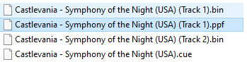
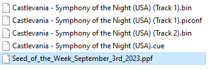

# ppfinjector

`ppfinjector` is a tool for adding on-the-fly PPF patching ability to the
[BizHawk](https://github.com/TASEmulators/BizHawk) emulators. It is developed
specifically for loading PPFs generated by the
[SotN-Randomizer](https://github.com/3snowp7im/SotN-Randomizer).

It may work with other 64-bit build Playstation (PSX) emulators on Windows. But
only BizHawk has been tested.

## Supported CD Image Format

Currently, only `.bin` file of the `cue/bin` format.

## Usage

### Basic Usage

1. Rename the PPF patch you want to load to match the bin file you want to patch.
   If your bin file is call `foo.bin`, rename your PPF to `foo.ppf`.
2. Place the PPF file next to the bin file.
3. Launch `emulauncher.exe`.
4. Select the emulator you want to use.
5. Play the game.

   

### Advanced Usage

1. Put the PPF file you want to use next to the bin file you want to patch.
2. Create a text file with the `.piconf` extention next to the bin file you want
   to patch and rename it to match the bin file. If your bin file is called
   `foo.bin` the patch config file should be called `foo.piconf`. You may need
   to disable `Hide extensions for known file types` in `Explorer` in order to
   rename the config file successfully.
2. Edit the `.piconfig` file with a text editor. `Notepad` should work.
3. The config is a json file. Add the PPF file you want to use to the `patch`
   value and save the config.
   ``` json
   {
      "patch": "Seed_of_the_Week_September_3rd_2023.ppf"
   }
   ```
   `patch` accepts either an absolute path or a path relative to the directory
   the config file is in.
4. Launch `emulauncher.exe`
5. Select the emulator you want to use.
6. Play the game.

   

### Configuration

#### Application Configuration

On first launch, `emulauncher` creates `ppfinjector.json` to store its configuration
data in the same directory. Application configuration is used both by the launcher
and the injector.

* `emulator`: Stores the path of the emulator the launcher launched most recently.
  If you want to use a different emulator, you can either delete this property
  from the configuration file, or delete the configuration file entirely.
* `log_level`: Set the logging level of the launcher and the injector. Default is
  `1`. This is `INFO` level. You can set it to a big number to disable logging
  entirely.
* `target_extensions`: This is a list of extenions the injector checks when the
  emulator opens a file. Currently, only bin files from the CUE/BIN format is
  supported.

#### Patch Configuration

Patch configuration has the extension `.piconf`. It tells the injector dll which
PPF file to load when patching the target file.

* `patch`: Points to the path of the PPF file. It can be an absolute path, or a
  path relative to the directory the config file is in.
* `calculate_edc`: A boolean value that tells the injector whether EDC checksum
  needs to be calculated. Default is `true`. But if you have a PPF that contains
  the recalculated EDC value already, you can set this to `false`.
